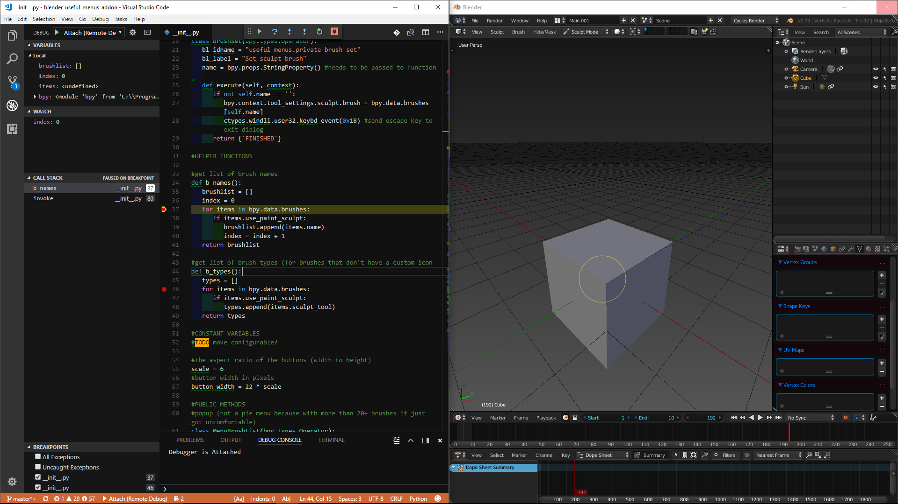

# Blender Debugger for VS Code (and Visual Studio)

Inspired by [Blender-VScode-Debugger](https://github.com/Barbarbarbarian/Blender-VScode-Debugger) which was itself inspired by this [remote_debugger](https://github.com/sybrenstuvel/random-blender-addons/blob/master/remote_debugger.py) for pycharm as explained in this [Blender Developer's Blog post](https://code.blender.org/2015/10/debugging-python-code-with-pycharm/). 


Since the VS Code one wasn't really well documented and it looked kind of dead, once I figured it out, I was just going to add the documentation, but then I ended up rewriting the whole thing.

Now it can:

- Auto-detect where python is and auto set the path to ptvsd if installed.
- Warn you if you installed the wrong ptvsd version (for VS Code, for Visual Studio it should still work)
- Tell you when the debugger has actually attached.



# How to Use

I have made a video (click the image below) for those who just started messing with python in Blender or programming in general, but if you're semi-familiar with Python, VS Code, and the command line the following should make sense. If you have any questions or suggestions, don't hesitate to file an issue.

<strong>NOTE: ptvsd doesn't have to be version 3.0.0 anymore, so you can now ignore that and just `pip install ptvsd`</strong>

<p align="center" style="position:relative;">
   <a href="https://www.youtube.com/watch?v=UVDf2VSmRvk" title="Click to go to Video">
      
   </a>
</p>

## Note on Downloading

The best way to download is through the green `Clone or Download` button above.

If you download the add-on from the releases page, please make sure to rename the zip to `blender-debugger-for-vscode-master.zip`, otherwise the full stops / periods in the version number will cause the add-on to silently fail installing.

## Installing Python and Getting PTVSD

Install Python 3 with pip and check add to PATH.<sup id="n1">[1](#f1)</sup>
   - If you already have python installed and you can run it from the command line (aka PATH is set), the addon should find it. It checks `where python` or `whereis python` or `which python` to try and determine where python is and uses the first path given<sup id="n2">[2](#f2)</sup>.
   - If you are using something like Conda and want to use a virtual environment, to have the addon auto-detect the path you can: activate the environment, run Blender from the command line, and it should work.

`pip install ptvsd`
   - The following is no longer the case, the latest ptvsd version should work just fine now. <strike>Newer versions will not work, the add-on will warn you in the console if the version is above 3.0.0. Later versions aren't supported yet in VS Code, and it will throw an error when trying to connect. See [Debugging Python with VS Code](https://code.visualstudio.com/docs/python/debugging#_remote-debugging) and [#514](https://github.com/Microsoft/vscode-python/issues/514).</strike>
   - For Visual Studio, later versions should work depending on the Visual Studio version. I have never used Visual Studio, but you can find more info on setting everything up here: [Remotely Debugging Python Code on Linux](https://docs.microsoft.com/en-us/visualstudio/python/debugging-python-code-on-remote-linux-machines#connection-troubleshooting). (it is not Linux specific)

## Setting up your Addon

This is the most important part. Otherwise it won't work. I thought it was my VS Code config but no, it was this.

In Blender go to: `User Preferences > File` and set the path to `Scripts` to the folder you're developing your addon in (e.g: "C:\Code\Blender Stuff") BUT the folder must look like this:

```
Blender Stuff
└── addons
   ├── your-addon-folder
      ├── __init__.py
      ├── ...etc
   ├── another-addon
   ├── ...
```

Now remove your addon from Blender if it was installed, save settings, and when you restart your addon should be installed automatically.

## Setting up this Addon

Install the addon.

If it did not find the path it'll say "PTVSD not Found", you'll have to set it manually. It's wherever python is + "\lib\site-packages". NO trailing backslash.

If you want, increase the timeout for the confirmation. It'll print "Waiting..." in the console every second until it prints it's timedout. This does not mean the server has timedout *just* the confirmation listener.

Open up Blender's search (default shortcut: space), type "Debug".

Click `Debug: Start Debug Server for VS Code`. Note: you can only start the server once. You cannot stop it, at least from what I understand. If you run it again it'll just tell you it's already running and start the timer again to check for a confirmation.

## Connecting the Editor

Open your addon folder (e.g. "C:\Code\Blender Stuff\addons\myaddon").

Install the Python extension for VS Code if you haven't already. For Visual Studio see [Installing Python Support](https://docs.microsoft.com/en-us/visualstudio/python/installing-python-support-in-visual-studio).

In the lower left ([see #3 here](https://code.visualstudio.com/docs/python/python-tutorial#_prerequisites)), VS Code should have auto detected your Python install and set it as the interpreter. For Visual Studio see [Managing Python Environments](https://docs.microsoft.com/en-us/visualstudio/python/managing-python-environments-in-visual-studio).

Go to the Debugging tab and add a configuration. Pick Python. You'll want the configuration that looks like this, no need to change the defaults, you can delete the rest. 

```JSON
   {
      "name": "Python: Attach",
      "type": "python",
      "request": "attach",
      "port": 5678, //careful, this used to be 3000 in older versions of vscode and this addon
      "host": "localhost"
   },
```

Now when you run the debugger with this config in Blender and VS Code the console should print "Debugger is Attached" if it was still waiting (it should still attach even if it wasn't, it just won't tell you).

## How to Use

At this point you should be able to add a breakpoint and when you trigger it in Blender, Blender should freeze and VS Code should pause on the breakpoint.

Note though that if you make changes to the file, Blender will not detect them. Have open `User Preferences > Addons` so you can toggle your addon on and off when you make changes. If anyone knows any way to improve this I'd love to know.

### Debugging/Editing Source Code

It is possible to edit the Blender source code but it can be a bit tricky to get it to detect changes (nevermind live editing is buggy anyways).

From blender you can right click just about anything and click "Edit Source" to get it in the text editor. Then to find the path of the file, go to `Text > Save As` and copy it from there.

Open the file in VS Code, connect to the debugging server, make a change and save it.

Now in Blender the text editor will show this little red button in the top left. Click that and reload the file. Then in `Text Editor > Properties` turn on `Live Edit` if you haven't already. Now to actually get Blender to detect any changes you made just type a single character (like add a space anywhere) and *then* it will detect your changes.
 
 
### Debugging/Editing Scripts

   See [Issue #4](https://github.com/AlansCodeLog/blender-debugger-for-vscode/issues/4) for a workaround. 
   In the future if I have some time, I might see if there's something I can do to make this easier.

# Troubleshooting

- Check you installed the correct ptvsd version. With VS Code this should no longer be an issue, but I believe different versions of Visual Studio need different versions of ptvsd (see [Installing Python Support](https://docs.microsoft.com/en-us/visualstudio/python/installing-python-support-in-visual-studio)).
- To determine whether the problem is on Blender's side or your editor's: Close Blender and download/copy this [test script](https://gist.github.com/AlansCodeLog/ff1b246a8e31938e1c3dbfdcbb90522f) and run it with Python, and then try to connect to the server with your editor. If you're still getting problems then the problem is with VS Code, try:
      - Check your detected your Python install, or set it manually.
      - For VS Code try reinstalling the VS Code Python extension.
- If you've been using this addon for a while and it's suddenly giving you a connection error, it might be because the default port has changed. VS Code's Python extension (vscode-python) has changed their default port from 3000 to 5678, so I have changed the default accordingly. I've made it configurable now though, so just check the port the addon is set to matches the one in your `launch.json` in VS Code.

Otherwise, if none of that helped, don't hesitate to file an issue.

# Notes

<a id="f1" href="#n1">1.</a> Technically, the add-on will work with Python 2 as well since it doesn't use Python itself, just the ptvsd package, so it doesn't really matter whether you installed it with Python 2 or 3 because the package is compatible with both. On the VS Code side though, the Python extension does need to know where Python is (though not ptvsd), but it will still connect if it's using Python 2, just IntelliSense recommendations the will be wrong.

<a id="f2" href="#n2">2.</a> The addon also detects python if PYTHONPATH is set (because Blender will add it to sys.path) or if you used the Python bundled with Blender to install ptvsd (but that's a bit of a pain because it doesn't have pip installed, you would have to install it manually).